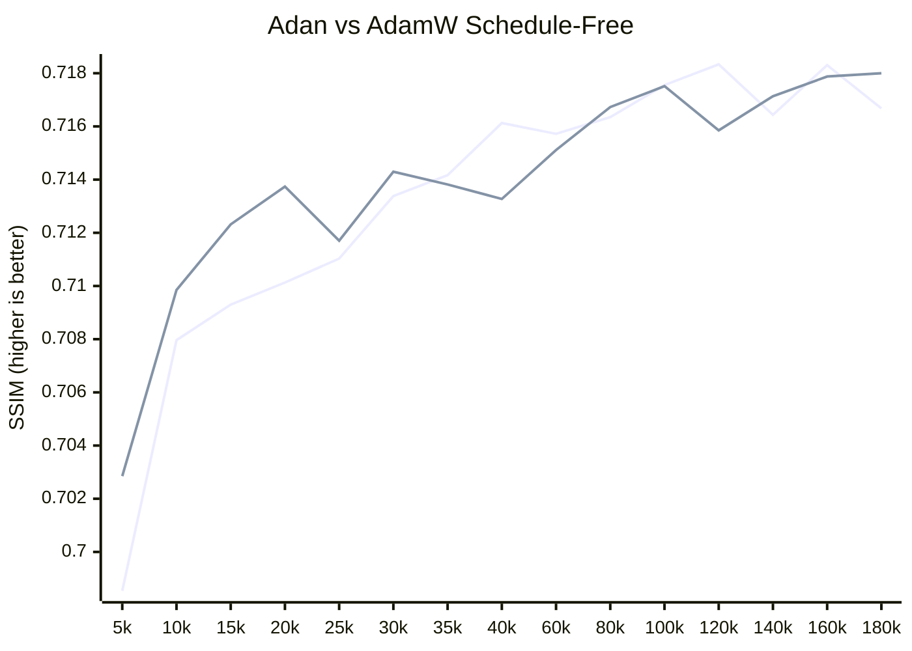

Unofficial `foreach` implementation of [Adan](https://github.com/sail-sg/Adan) (Adaptive Nesterov Momentum) with [Schedule-Free](https://github.com/facebookresearch/schedule_free). 

> [!NOTE]
> To use this optimizer `optimizer.train()` and `optimizer.eval()` must be called at the same place where `model.train()` and `model.eval()` are called. The optimizer should also be placed in eval mode when storing checkpoints.

Code developed on python 3.12 and pytorch =>2.3

## experiments

In order to test the potential of Adan Schedule-Free, a small experiment was conducted using SISR (single-image super-resolution) under the same, bit-wise [deterministic](https://pytorch.org/docs/stable/generated/torch.use_deterministic_algorithms.html), setting. The [SPAN](https://github.com/hongyuanyu/SPAN) network was trained up to 180k iters, reducing [charbonnier](https://github.com/muslll/neosr/blob/master/neosr/losses/basic_loss.py#L133) loss. Both optimizers used the same learning rate of `2.5e-3`. For AdamW Schedule-Free, betas `[0.9, 0.99]` were used, no decay. For Adan Schedule-Free, betas `[0.98, 0.92, 0.987]` and decay `0.02` were used. Results shown bellow.

- Visuals:


- Metrics (Adan-SF - Green | AdamW-SF Blue):


## license and acknowledgements

Released under [Apache 2.0](https://github.com/muslll/adan_schedule_free/license). Code adapted from official repositories [Adan](https://github.com/sail-sg/Adan) and [Schedule-Free](https://github.com/facebookresearch/schedule_free).

Original research papers:
```tex

@article{xie2022adan,
  title={Adan: Adaptive Nesterov Momentum Algorithm for Faster Optimizing Deep Models},
  author={Xie, Xingyu and Zhou, Pan and Li, Huan and Lin, Zhouchen and Yan, Shuicheng},
  journal={arXiv preprint arXiv:2208.06677},
  year={2022},
  archivePrefix={arXiv},
  primaryClass={cs.LG}
  url={https://arxiv.org/abs/2208.06677}
}

@article{defazio2024road,
  title={The Road Less Scheduled},
  author={Aaron Defazio and Xingyu Yang and Harsh Mehta and Konstantin Mishchenko and Ahmed Khaled and Ashok Cutkosky},
  journal={arXiv preprint arXiv:2405.15682},
  eprint={2405.15682}
  year={2024},
  archivePrefix={arXiv},
  primaryClass={cs.LG}
  url={https://arxiv.org/abs/2405.15682}
}
```

## support me

> [!TIP]
> Consider supporting me on [**KoFi**](https://ko-fi.com/muslll) &#9749; or [**Patreon**](https://www.patreon.com/neosr)
